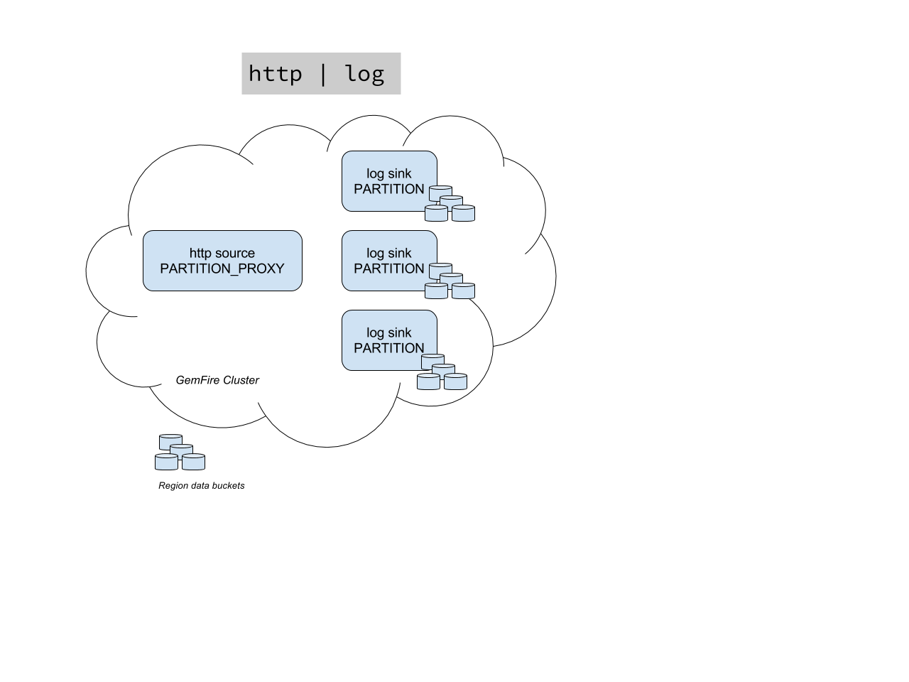

# This repository is no longer actively maintained by VMware, Inc.

== GemFire Binder for Spring Cloud Stream

The GemFire Binder for Spring Cloud Stream uses the GemFire data grid for storing and routing messages between Spring Cloud Stream modules. The premise for this project is to provide a messaging solution with the following attributes:

* in memory
* low latency
* high throughput
* horizontally scalable
* self contained

The following messaging characteristics do not apply to this project:

* exactly once message delivery
* large amounts of messages (that far exceed physical memory)

== Overview

Spring Cloud Stream modules use a binder to bind themselves to a message channel backed by a messaging system. In most cases, the messaging system is running in separate processes and possibly on separate hardware. However, the GemFire binder will cause the JVM running the module to connect to a GemFire cluster as a peer. This has the following implications:

* a separate messaging system is not required; the JVMs running the modules are also hosting the messaging system
* messages destined to a processor or sink module will be delivered directly to the JVM running the module; the module does not need to fetch messages from another process

Messages will be stored in a partitioned region. Processor and sink modules will host buckets for a region, meaning that the JVMs running these modules will also contain the messages in memory. When a message is added to a region, an event is raised which causes the binder to publish the message to the configured channel for the processor or sink.

Source modules will place messages into a region; however these modules will not host buckets for a partitioned region since these modules are producing data instead of consuming it. This can be done by configuring their regions as `PARTITION_PROXY`, or by having these modules connect to the cluster as clients.

